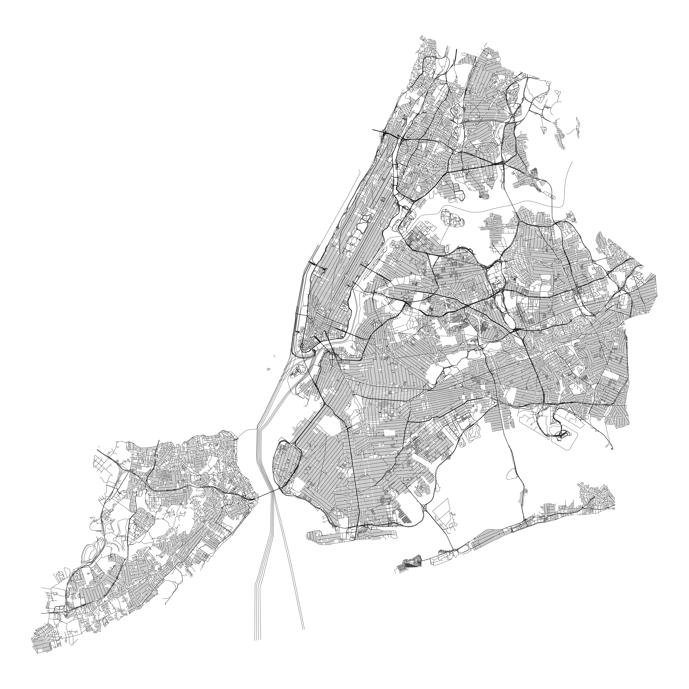

# nycstreets 

Provides an sf object containing the New York City street centerline
dataset from NYC Open Data.

## Installation

You can install the development version of nycstreets from
[GitHub](https://github.com/) with:

``` r
# install.packages("pak")
pak::pak("kjhealy/nycstreets")
```

## The dataset

``` r
library(tidyverse)
#> ── Attaching core tidyverse packages ──────────────────────────────────────────────────────────────────── tidyverse 2.0.0 ──
#> ✔ dplyr     1.2.0     ✔ readr     2.2.0
#> ✔ forcats   1.0.1     ✔ stringr   1.6.0
#> ✔ ggplot2   4.0.2     ✔ tibble    3.3.1
#> ✔ lubridate 1.9.5     ✔ tidyr     1.3.2
#> ✔ purrr     1.2.1     
#> ── Conflicts ────────────────────────────────────────────────────────────────────────────────────── tidyverse_conflicts() ──
#> ✖ dplyr::filter() masks stats::filter()
#> ✖ dplyr::lag()    masks stats::lag()
#> ℹ Use the conflicted package (<http://conflicted.r-lib.org/>) to force all conflicts to become errors
library(sf)
#> Linking to GEOS 3.13.0, GDAL 3.8.5, PROJ 9.5.1; sf_use_s2() is TRUE
library(nycstreets)
nyc_streets_sf
#> Simple feature collection with 122054 features and 65 fields
#> Geometry type: MULTILINESTRING
#> Dimension:     XY
#> Bounding box:  xmin: 913351.6 ymin: 120769.2 xmax: 1067379 ymax: 272691.1
#> Projected CRS: NAD83 / New York Long Island (ftUS)
#> First 10 features:
#>   physicalid l_low_hn l_high_hn r_low_hn r_high_hn l_zip r_zip status bike_lane
#> 1      46810      901       999      900       998 11230 11230      2      <NA>
#>   trafdir rw_type pre_type post_type objectid  fcc l_blockfac r_blockfac
#> 1      FT       1      AVE      <NA>    42563 <NA> 1822608708 1822600714
#>   avgtravtim rwjurisdic nominaldir accessible nonped boroughcod borough_in
#> 1         NA       <NA>       <NA>       <NA>   <NA>          3       <NA>
#>   seglocstat sandist_in lsubsect rsubsect continuous twisted_pa posted_spe
#> 1          X       <NA>       6E       6E       <NA>          N         25
#>   segmentlen streetwidt streetwi_2 special_di fire_lane date_creat   time_creat
#> 1   260.1442         34       <NA>       <NA>      <NA> 2007-11-29 00:00:00.000
#>   date_modif   time_modif within_bnd truck_rout collection from_level
#> 1 2020-08-28 20:49:50.000       <NA>       <NA>       <NA>         13
#>   to_level_c   b5sc snow_prior joinid bphys_id carto_disp number_tra number_par
#> 1         13 314280          C   <NA>       NA       <NA>          2          2
#>   number_tot pre_modifi pre_direct post_direc post_modif full_stree bike_trafd
#> 1          4       <NA>       <NA>       <NA>       <NA>      AVE N       <NA>
#>   shape_leng                             globalid segment_ty segment_2
#> 1    104.315 cedc2dde-7e8b-4427-af4c-c7fe5174b2c7       <NA>      <NA>
#>   street_nam stname_lab                       geometry
#> 1          N      AVE N MULTILINESTRING ((993887.4 ...
#>  [ reached 'max' / getOption("max.print") -- omitted 9 rows ]
```

``` r
nyc_streets_sf |>
  ggplot() +
  geom_sf(linewidth = 0.1) +
  theme_void()
```


